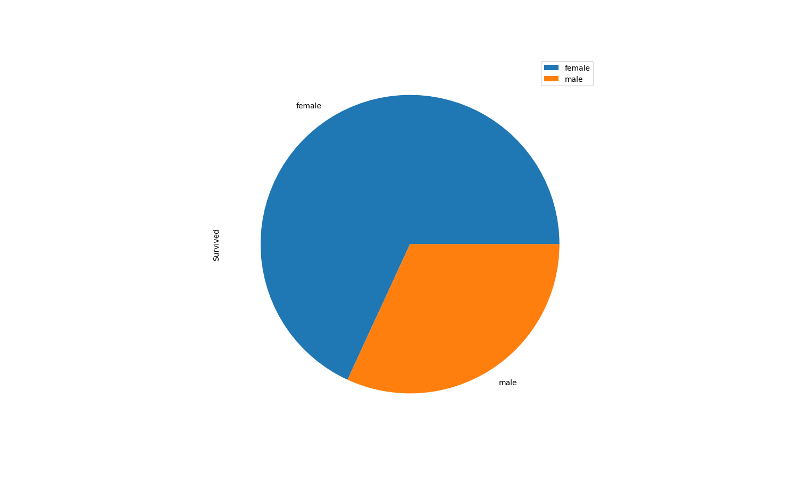
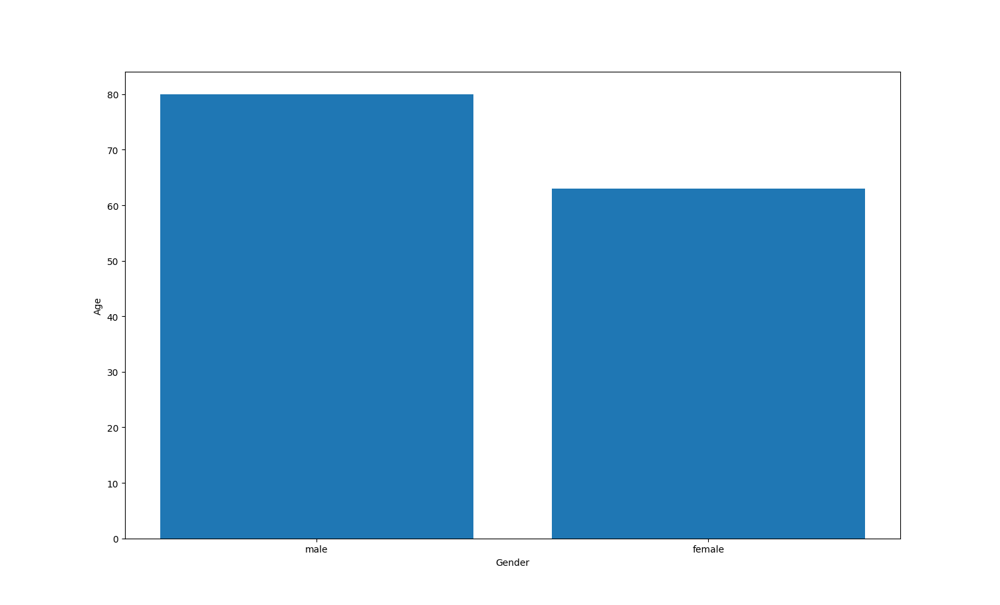
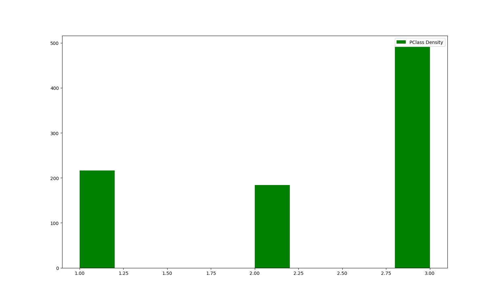
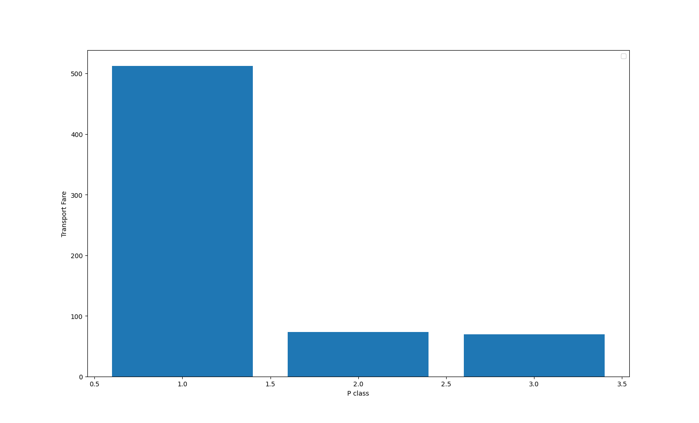
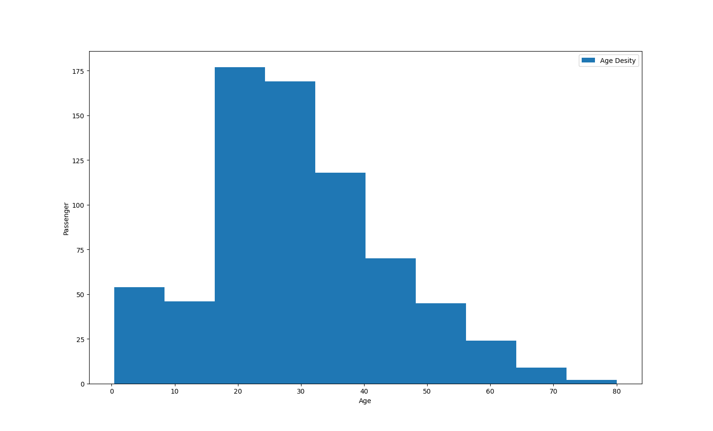

Week One Task

># Q.1: Exploratory Data Analysis (EDA)
- Using any of the following datasets (e.g., Iris dataset, Titanic dataset, or a dataset related to
your area of interest), perform exploratory data analysis, including:
- Loading and inspecting the data
- Handling missing values
- Summarizing numerical and categorical variables
- Visualizing the distributions and relationships between variables
> Using Iris dataset

    import pandas as pd

    from matplotlib import pyplot as plt
 
    resource_path =  'tasks/week_one/resources/Iris.csv'

  > loading

    records = pd.read_csv(resource_path)

>inspecting Data Types

    print("Inspecting Data types")

    Output:
    RangeIndex: 150 entries, 0 to 149
    Data columns (total 6 columns):
     Column         Non-Null Count 	 Dtype
     
     0   Id            	150 non-null    int64
     1   SepalLengthCm  150 non-null    float64
     2   SepalWidthCm   150 non-null    float64
     3   PetalLengthCm  150 non-null    float64
     4   PetalWidthCm   150 non-null    float64
     5   Species       	150 non-null    object
    dtypes: 
		    float64(4), int64(1), object(1)
    memory usage: 7.2+ KB
    dataInfo = records.info()

 > handling missing values

    df = pd.DataFrame(records)

    handle_mising = df.dropna()
    Output: DataFrame

> Summary

    summary = records.head()
    print(f"{summary}")
    Output:

	    Id  SepalLengthCm  SepalWidthCm  PetalLengthCm  PetalWidthCm  Species
    0   1            5.1           3.5            1.4           0.2  Iris-setosa 
    1   2            4.9           3.0            1.4           0.2  Iris-setosa 
    2   3            4.7           3.2            1.3           0.2  Iris-setosa
    3   4            4.6           3.1            1.5           0.2  Iris-setosa
    4   5            5.0           3.6            1.4           0.2  Iris-setosa
    

>Visualizing the distributions and relationships between the variables

    df = pd.DataFrame(records, columns=['Species', 'SepalLengthCm', 'SepalWidthCm', 'PetalLengthCm', 'PetalWidthCm'])
    df.plot(x="Species", y=['SepalLengthCm', 'SepalWidthCm', 'PetalLengthCm', 'PetalWidthCm'], color=['purple', 'purple', 'red', 'red'])
    
    plt.ylabel('Metrics')

    plt.show()

> Output: Plot  Category by Metrics
 

> # Q. 2: Data Cleaning and Preprocessing:
   - Given a messy dataset (e.g., with inconsistent data formats, missing values, duplicates).
   - Write Python scripts to clean and preprocess the data, including:
   - Handling missing values (e.g., imputation, dropping rows/columns)
   - Removing duplicates
   - Converting data types
   - Handling categorical variables (e.g., one-hot encoding, label encoding)
   - Scaling numerical features
> using NYC Airbnb listings Dataset

    import pandas as pd

    from matplotlib import pyplot as plt
    
    path =  'tasks/week_one/resources/AB_NYC_2019.csv'

    outpath=  'tasks/week_one/resources/clean_AB_NYC_2019.csv'
>Reading File
    records = pd.read_csv(path)

    df = pd.DataFrame(records)
    
   >Handling missing values (dropping rows/columns)

    after_trunc = df.dropna()
>Removing duplicates

    rmv_duplicates = after_trunc.drop_duplicates(keep=False)

>Converting data types

    print(f"Initial dataTypes: \n  {rmv_duplicates.dtypes}")
    
    Output: 
   
    Initial dataTypes: 
    id int64
    name object
    host_id int64
    host_name object
    neighbourhood_group object
    neighbourhood object
    latitude float64
    longitude float64
    room_type object
    price int64
    minimum_nights int64
    number_of_reviews int64
    last_review object
    reviews_per_month float64
    calculated_host_listings_count int64
    availability_365 int64
    dtype: object

  

>change column[price] data type from int to float

    rmv_duplicates['price'] = rmv_duplicates['price'].astype(float)

    print(f"Final dataTypes: \n  {rmv_duplicates.dtypes}")
    
    Output:
    
    Final dataTypes:
    id int64
    name object
    host_id int64
    host_name object
    neighbourhood_group object
    neighbourhood object
    latitude float64
    longitude float64
    room_type object
    price float64
    minimum_nights int64
    number_of_reviews int64
    last_review object
    reviews_per_month float64
    calculated_host_listings_count int64
    availability_365 int64
    dtype: object

  

>Handling categorical variables (label encoding)

 
>Scaling numerical features

  
  
> Save modified data to outpath
    
    newFile = rmv_duplicates.to_csv(outpath, index=False)

> # Q. 3: Data Visualization
- You have a dataset with multiple variables (numerical and categorical).
- Create various visualizations using Matplotlib or other libraries (e.g., scatter plots, histograms,
bar charts, box plots, heatmaps).
- Experiment with different plot types and customizations.

> using Titanic dataset (from Kaggle)

    import pandas as pd
    from matplotlib import pyplot as plt
  

    path =  'tasks/week_one/resources/Titanic-Dataset.csv'
    
    records = pd.read_csv(path)

    df = pd.DataFrame(records)
    
    gender = df['Sex']
    
    survived = df['Survived']
    
    Pclass = df['Pclass']
    
    Age = df['Age']
    
    SibSp = df['SibSp']
    
    Fare = df['Fare']
    
    Ticket = df['Ticket']
    
    Embarked = df['Embarked']

 >## Plots Between:

>Sex(Gender) and Survived Passenger

    df.groupby(['Sex']).sum().plot(kind='pie', y='Survived')
    plt.show()

> Fare and Age

    plt.scatter(Fare, Age)
    
    plt.xlabel('Fare')
    
    plt.ylabel('Age')
    plt.show()

>Gender and Age

  

    plt.bar(gender, Age)
    
    plt.xlabel('Gender')
    
    plt.ylabel('Age')
    plt.show()

>P class Population Desity

  

     plt.hist(Pclass, color='green', label="PClass Density")
    
    plt.legend()
	plt.show()

>P class Population and Fare

  

    plt.bar(Pclass, Fare)
    
    plt.xlabel("P class")
    
    plt.ylabel("Transport Fare")
    
    plt.legend()
    plt.show()
    

> Age Density

  

    plt.hist(df['Age'], label="Age Desity")
    
    plt.legend()
    
    plt.xlabel('Age')
    
    plt.ylabel('Passenger')
    plt.show()

